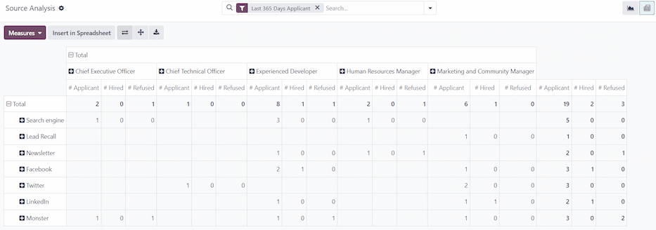
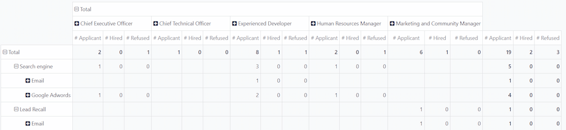

=========================
Source Analysis Reporting
=========================

Reporting is a critical tool for any recruiting department, to gain insights into the entire
recruitment process.

Determining where applicants come from can shed light on which sources provide the best results.
This information is determined by the *Source ANalysis* report. With this data, recruitment teams
can better pivot their recruiting strategies, in an attempt to gain better applicants, in both
quantity and quality.

Open report
===========

To access the *Source Analysis* report, navigate to :menuselection:`Recruitment app --> Reporting
--> Source Analysis`. This presents the data for the :icon:`fa-filter` :guilabel:`Last 365 Days
Applicant`, in a default :icon:`fa-area-chart` :guilabel:`Graph` view, showing the amount of
applicants by :guilabel:`Source`, and further separated by stage (:guilabel:`In Progress` and
:guilabel:`Hired`). Hover the cursor over any column to view the specific numbers fort that column.

.. image:: source_analysis/source-analysis.png
   :align: center
   :alt: The default bar chart of the source analysis information.

Pivot Table
===========

To view more details, view the :guilabel:`Source Analysis` report in a pivot table. While on the
:guilabel:`Source Analysis` report page, click the :icon:`oi-view-pivot` :guilabel:`Pivot` button in
the top-right corner. The data is presented in a pivot table, with rows populated by job position,
and columns populated stage.

To expand this chart to show what specific sources the applicants came from, click into the
:icon:`fa-plus-square` :guilabel:`Total` box, above the columns to reveal a drop-down menu, and
click :guilabel:`Source`.

Now, each column is grouped by the source: :guilabel:`Search engine`, :guilabel:`Facebook`,
:guilabel:`Newsletter`, etc. Each source displays the separate count for :guilabel:`Applicant`,
:guilabel:`Hired`, and :guilabel:`Refused`, for each source.

This information as presented makes it difficult to view the specific numbers for each source. Click
the :icon:`fa-exchange` :guilabel:`Flip axis` icon, in the upper-left corner of the page, to swap
the information. After clicking the :icon:`fa-exchange` :guilabel:`Flip axis` icon, the rows
represent the source, and the columns represent the job positions, further divided by stage.

In this view, the total number of applicants, hired employees, and refused applicants, are displayed
for each source, as well as for each stage by job position.

Medium
------

Sometimes, further information is desired to gain a more complete insight as to the complete source
of applicants. Viewing the medium for the applicants can be beneficial to see which specific medium
is more successful.

To further group the results by medium, click into a row beneath the :icon:`fa-minus-square-o`
:guilabel:`Total` box. Click :guilabel:`Medium` in the resulting drop-down menu. The row presents
the specific mediums, relevant to that specific source.

Once :guilabel:`Medium` is selected for one source, clicking into another row automatically reveals
the specific metrics for the mediums for that source.

.. note::
   The only mediums that appear for a source, are mediums that have been selected on an applicant's
   form. If a medium has **not** been selected for any applicants, the medium **does not appear** in
   the drop-down rows beneath the source.

   For example, if no applicant's selected the medium :guilabel:`Google Adwords`, that medium does
   **not** appear beneath the :guilabel:`Search engine` source row.
